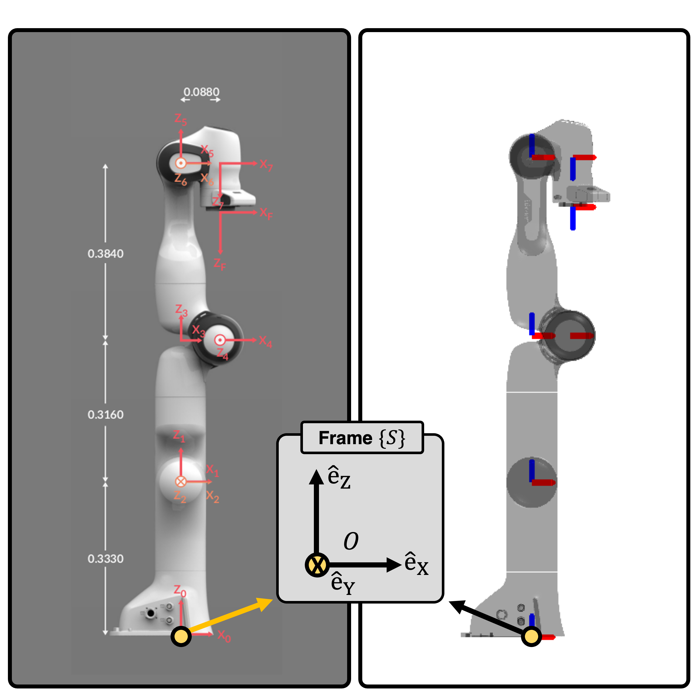

==========================================
Derivation of franka's Inertia Parameters
==========================================
In this post, we show the detailed derivation of the `inertial parameters of franka`_.

The original values are derived from Figure 4 of the paper from `Ledezma, Fernando Diaz and Haddadin, Sami`_.
For the :math:`i`-th link, the mass :math:`m`, mass times the center of mass location :math:`mc_x`, :math:`mc_y`, :math:`mc_z`, and the 6 paramters of the inertia tensor matrix, 
:math:`I_{xx}`, :math:`I_{xy}`, :math:`I_{xz}`, :math:`I_{yy}`, :math:`I_{yz}`, :math:`I_{zz}` about the center of mass are:

.. list-table:: 
   :widths: 25 20 40 45 
   :header-rows: 1
   :align: center 

   * - Linkage
     - :math:`m` (:math:`kg`)
     - :math:`mc_x`, :math:`mc_y`, :math:`mc_z`  (:math:`kg\cdot m`)
     - :math:`I_{xx}`, :math:`I_{xy}`, :math:`I_{xz}`, :math:`I_{yy}`, :math:`I_{yz}`, :math:`I_{zz}` (:math:`kg\cdot m^2`)
   * - Link 1, :math:`i=1`
     - 4.9707
     - (0.0193, 0.0103, -0.4654)
     - (0.7470, -0.0002, 0.0086, 0.7503, 0.0201, 0.0092)
   * - Link 2, :math:`i=2`
     - 0.6469
     - (-0.0020, -0.0186, 0.0023)
     - (0.0085, -0.0040, 0.0103, 0.0281, 0.0008, 0.0265)
   * - Link 3, :math:`i=3`
     - 3.2286
     - (0.0888, 0.1267, -0.2147)
     - (0.0565, -0.0082, -0.0055, 0.0529, -0.0044, 0.0182)
   * - Link 4, :math:`i=4`
     - 3.5879
     - (-0.1908, 0.3746, 0.0985)
     - (0.0677, 0.0277, 0.0039, 0.0324, -0.0016, 0.0776)
   * - Link 5, :math:`i=5`
     - 1.2259
     - (-0.0147, 0.0503, -0.0471)
     - (0.0394, -0.0015, -0.0046, 0.0315, 0.0022, 0.0109)
   * - Link 6, :math:`i=6`
     - 1.6666
     - (0.1002, -0.0235, -0.0175)
     - (0.0025, 0.0015, -0.0001, 0.0106, 0.0001, 0.0118)
   * - Link 7, :math:`i=7`
     - 1.4655
     - (0.0004, -0.0031, 0.1453)
     - (0.0308, 0.0004, -0.0007, 0.0284, -0.0005, 0.0067)

The inertial parameters of the :math:`i`-th link are described with respect to the frame at the :math:`i`-th joint.
This frame is defined by the Denavit–Hartenberg (DH) parameters. 
The DH parameters of the 7 frames attached to the 7 joints are listed in `this website`_, and shown below:

.. list-table:: 
   :widths: 25 20 20 20 20
   :header-rows: 1
   :align: center 

   * - Joint
     - :math:`a` (m)
     - :math:`d` (m)
     - :math:`\alpha` (rad)
     - :math:`\theta` (rad)
   * - Joint 1
     - 0
     - 0.333
     - 0
     - :math:`\theta_1` 
   * - Joint 2
     - 0
     - 0
     - :math:`-\pi/2`
     - :math:`\theta_2` 	 
   * - Joint 3
     - 0
     - 0.316
     - :math:`\pi/2`
     - :math:`\theta_3` 	 	 
   * - Joint 4
     - 0.0825
     - 0
     - :math:`\pi/2`
     - :math:`\theta_4` 	 	 	 
   * - Joint 5
     - -0.0825
     - 0.384
     - :math:`-\pi/2`
     - :math:`\theta_5`
   * - Joint 6
     - 0
     - 0
     - :math:`\pi/2`
     - :math:`\theta_6`	  	 	 	 	 
   * - Joint 7
     - 0.088
     - 0
     - :math:`\pi/2`
     - :math:`\theta_7`	  	 	 	 	 	 

Let the frame attached at the i-th joint be denoted as :math:`\{i\}`. 
For :math:`i=1,2,\cdots, 7`, the relation between frame :math:`\{i\}` and :math:`\{i-1\}` is:

.. math::
	{}^{i-1}H_{i} = \begin{bmatrix}
									  \cos \theta_i & 			   -\sin\theta_i & 			   0 &			    a_i \\
						\sin \theta_i \cos \alpha_i & \cos\theta_i \cos \alpha_i & -\sin\alpha_i & -d_i\sin\alpha_i \\
						\sin \theta_i \sin \alpha_i & \cos\theta_i \sin \alpha_i &  \cos\alpha_i &  d_i\cos\alpha_i \\
												  0 & 						   0 & 			   0 &  		     1
					\end{bmatrix}

Subscript :math:`i` denotes the DH parameter of Joint :math:`i`. 
Moreover, frame :math:`\{0\}` is simply the fixed frame :math:`\{S\}` attached at the origin.

From this, we can find the frame attached at the :math:`i`-th joint by simple matrix computation:

.. math::
	\begin{align}
		{}^{S}H_{1} &= {}^{S}H_{1} \\
		{}^{S}H_{2} &= {}^{S}H_{1} {}^{1}H_{2} \\
		{}^{S}H_{3} &= {}^{S}H_{1} {}^{1}H_{2}{}^{2}H_{3} \\
			& ~~~~~~~ \vdots \\
		{}^{S}H_{7} &= {}^{S}H_{1} {}^{1}H_{2}{}^{2}H_{3} {}^{3}H_{4}{}^{4}H_{5}{}^{5}H_{6}{}^{6}H_{7} \\
	\end{align}
	
The result plotted in explicit (right) is consistent with the result shown from the `original franka website`_ (left).

|

Let the center of mass location of the :math:`i`-th link expressed in frame :math:`\{i\}` be denoted as :math:`{}^{i}\mathbf{c}_i := [{}^{i}c_{x,i},{}^{i}c_{y,i},{}^{i}c_{z,i}]`,
and the values are shown in the table above.
We simply need to map these values from frame :math:`\{i\}` to frame :math:`\{S\}`.
Thus, for :math:`i=1,2,\cdots,7`:

.. math::
	\begin{bmatrix}
		{}^{S}\mathbf{c}_i \\ 1 
	\end{bmatrix}
	= {}^{S}H_i 
	\begin{bmatrix}
		{}^{i}\mathbf{c}_i \\ 1 
	\end{bmatrix}

From this, we find the position of the center of mass, expressed in frame :math:`\{S\}`.
The detailed location and its values are posted in `this section`_.

Finally, we derive the moment of inertia matrix, but with respect to the axes of frame :math:`\{S\}`.
Let the moment of inertia matrix about frame :math:`\{i\}` be :math:`{}^{i}\mathbf{I}_i`
Considering that the moment of inertia matrix is a (0,2)-tensor, it is clear that the moment of inertia with respect to frame :math:`\{S\}` is:

.. math::
	{}^{S}\mathbf{I}_i = {}^{S}\mathbf{R}_i ~ {}^{i}\mathbf{I}_i ~ {}^{S}\mathbf{R}_i^{\text{T}}

In this equation :math:`{}^{S}\mathbf{R}_i\in SO(3)`, which can be derived from :math:`{}^{S}\mathbf{H}_i`.
This eventually gives us the inertia matrix `shown in this section`_.

.. _`this website`: https://frankaemika.github.io/docs/control_parameters.html#denavithartenberg-parameters
.. _`original franka website`: https://frankaemika.github.io/docs/control_parameters.html#denavithartenberg-parameters
.. _`inertial parameters of franka`: ../exp_robot/franka.html
.. _`Ledezma, Fernando Diaz and Haddadin, Sami`: https://ieeexplore.ieee.org/document/9561425
.. _`this section`: ../exp_robot/franka.html#the-locations-of-center-of-mass
.. _`shown in this section`: ../exp_robot/franka.html#inertia-tensor-of-each-linkage
