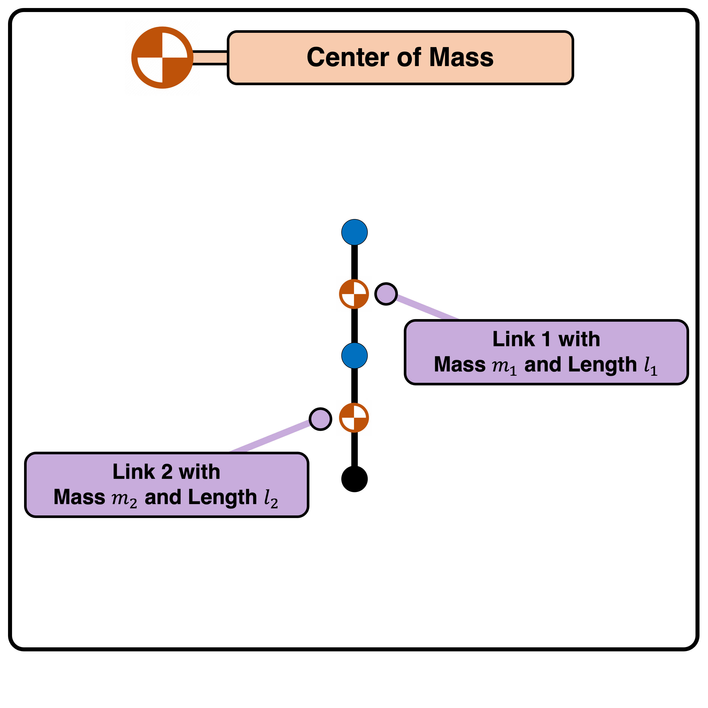
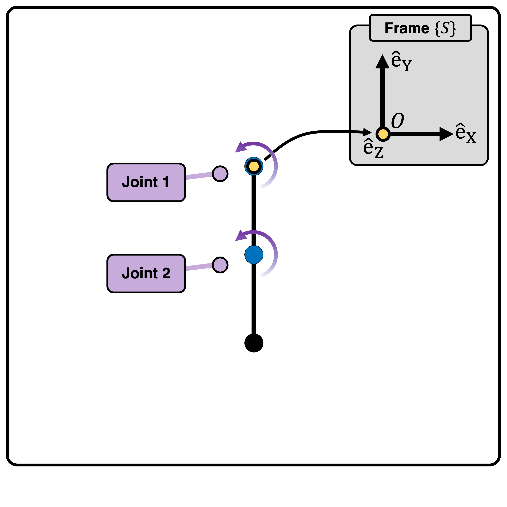
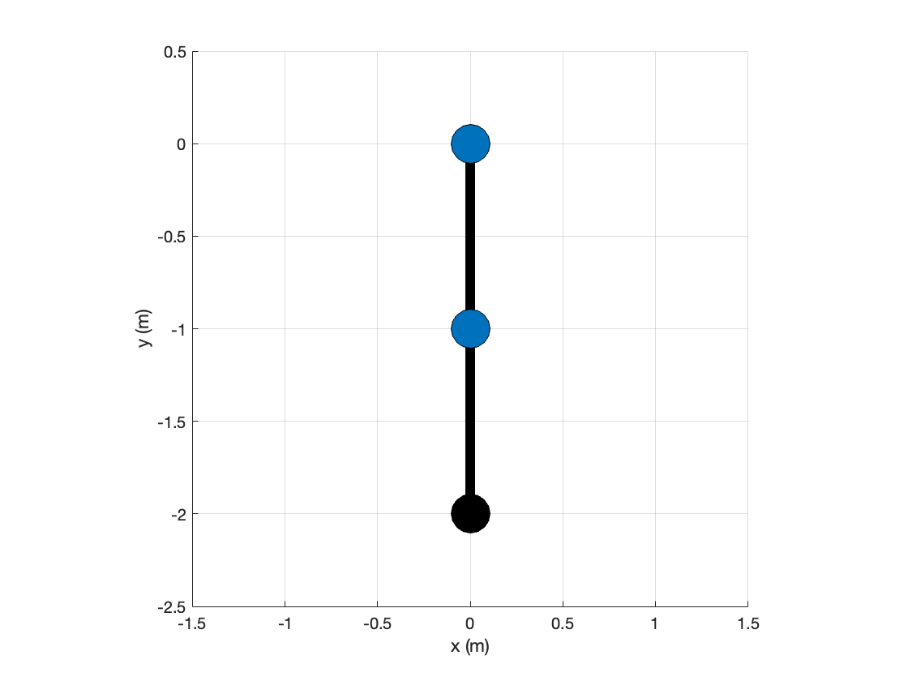

===============
Double Pendulum
===============

The double pendulum  (often called "Acrobot"), is a heavily used example in academia. 
The geometric and inertial parameters are shown below:

- The first link with mass :math:`m_1` and length :math:`l_1`.
- The second link with mass :math:`m_2` and length :math:`l_2`.

Here, we assume links with uniform mass distribution.

Initial Configuration and Joint Parameters
===========================================
Below, the robot in initial configuration with stationary coordinate frame :math:`\{S\}` and origin :math:`\{O\}`
is shown:

.. list-table:: 
   :widths: 15 25 25 25 35 
   :header-rows: 1
   :align: center 

   * - Joint
     - Type 
     - Point on Joint Twist Axis (m)
     - Joint Direction
     - Joint Twist 
   * - Joint 1
     - Revolute (1)
     - (0, 0, 0)
     - (0, 0, 1)
     - (1, 0, 0, 0, 0, 0)
   * - Joint 2
     - Revolute (1)
     - (0, :math:`-l_1`, 0)
     - (0, 0, 1)
     - (:math:`-l_1`, 0, 0, 0, 0, 1)

Example code
=========
To construct the cart-pole robot, run the following code:

.. code-block:: MATLAB

	% Geometric and Inertial Parameters of the double pendulum robot
	m1 = 1;		% The   mass of the  first link
	m2 = 1;		% The   mass of the second link
	l1 = 1;		% The length of the  first link
	l2 = 1;		% The length of the second link

	% Construct the double-pendulum robot and initialize
	robot = DoublePendulum( m1, m2, l1, l2 );
	robot.init( )

	% Attach the double-pendulum robot to animation for visualization
	anim = Animation( 'Dimension', 2, 'xLim', [-1.5,1.5], 'yLim', [-2.5,0.5] );
	anim.init( )
	anim.attachRobot( robot )

The output figure should look like this:

..
  Documentation
  ==============
  .. mat:autoclass:: robots.DoublePendulum
