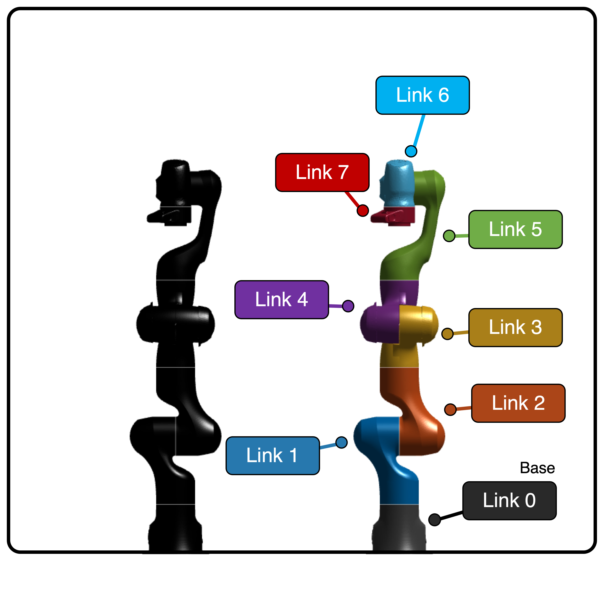
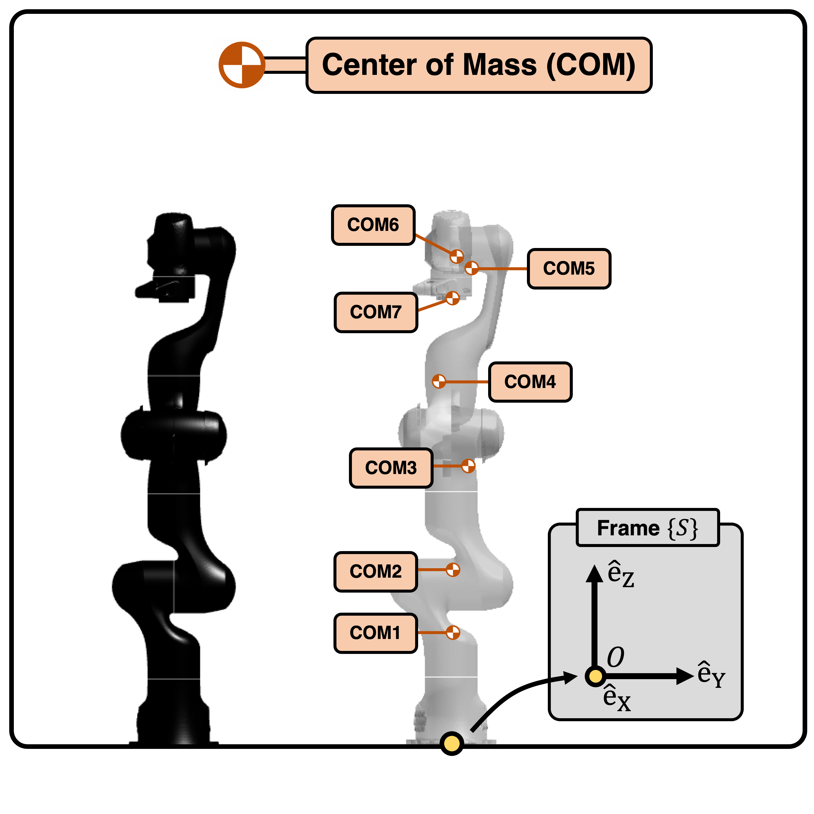
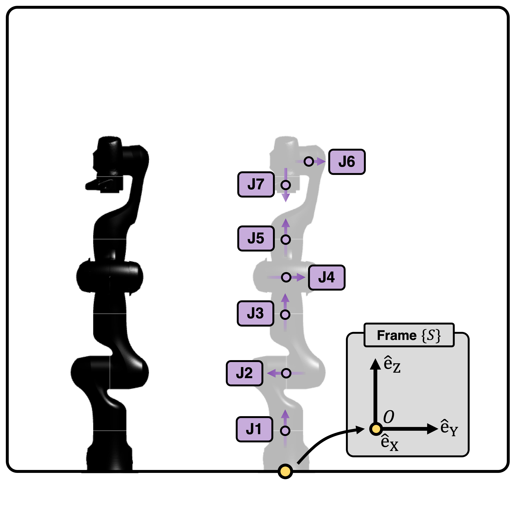
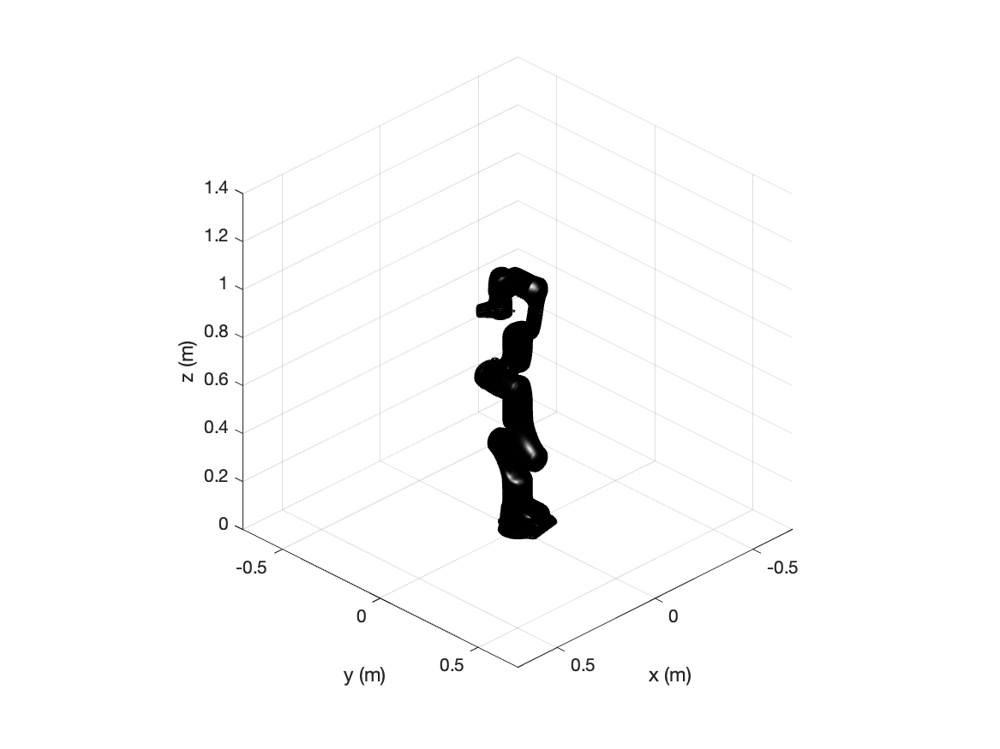

==============
Franka Emika
==============

The `Franka Emika Robot`_ is a kinematically redundant robot with 7 DOF. 
The links and the fixed base of the robot are shown below.

.. _`Franka Emika Robot`: https://www.franka.de/

The Locations of Center of Mass (CoM) 
=================================
The CoM locations of the 7 links are depicted below.

.. list-table:: 
   :widths: 20 40 15
   :header-rows: 1
   :align: center 

   * - Center of Mass
     - Center of Mass Locations (m)
     - Mass (kg)
   * - COM1
     - (0.0039, 0.0021, 0.2394)
     - 4.9707
   * - COM2
     - (-0.0031, 0.0036, 0.3618)
     - 0.6469
   * - COM3
     - (0.0275, 0.0392, 0.5825)
     - 3.2286 
   * - COM4
     - (0.0293, -0.0275, 0.7534)
     - 3.5879
   * - COM5
     - (-0.0120, 0.0410, 0.9946)
     - 1.2259
   * - COM6
     - (0.0601, 0.0105, 1.0189)
     - 1.6666
   * - COM7
     - (0.0883, 0.0021, 0.9339)
     - 1.4655
                       
Note that the CoM locations are all expressed with respect to frame :math:`\{S\}`.
The values are derived from Figure 4 in `this reference`_. 
The detailed derivation of these values are shown in `this post`_.

Initial Configuration and Joint Parameters
===========================================
Below, the robot in initial configuration with stationary coordinate frame :math:`\{S\}` and origin :math:`\{O\}`
is shown:

.. list-table:: 
   :widths: 5 20 25 12 63
   :header-rows: 1
   :align: center 
   

   * - Joint
     - Type 
     - Point on Joint Twist Axis (m)
     - Joint Direction
     - Joint Twist 
   * - J1
     - Rev. (1)
     - (0, 0, 0.3330)
     - (0, 0, 1)
     - (0, 0, 0, 0, 0, 1)
   * - J2
     - Rev. (1)
     - (0, 0, 0.3330)
     - (0, -1, 0)
     - (0.333, 0, 0, 0, -1, 0)
   * - J3
     - Rev. (1)
     - (0, 0, 0.6490)
     - (0, 0, 1)
     - (0, 0, 0, 0, 0, 1)
   * - J4
     - Rev. (1)
     - (0.0825, 0, 0.6490)
     - (0, 1, 0)
     - (-0.649, 0, 0.0825, 0, 1, 0)
   * - J5
     - Rev. (1)
     - (0, 0, 1.0330)
     - (0, 0, 1)
     - (0, 0, 0, 0, 0, 1)
   * - J6
     - Rev. (1)
     - (0, 0, 1.0330)
     - (0, 1, 0)
     - (-1.0330, 0, 0, 0, 1, 0)	 
   * - J7
     - Rev. (1)
     - (0.0880, 0, 1.0330)
     - (0, 0, -1)
     - (0, 0.0880, 0, 0, 0, -1)	 

Here, "Rev."" stands for revolute joint.

Inertia Tensor of each Linkage
================================================
Given axes :math:`\hat{e}_x`, :math:`\hat{e}_y`, :math:`\hat{e}_z`, the inertia matrices of the 
links about the CoM, :math:`I_i` are shown below:

.. list-table:: 
   :widths: 50 50 
   :align: center 

   * - .. figure:: ../images/franka_linkage1.png
          :width: 100%	

     - .. math::
			I_{1} = \begin{bmatrix}
    					\phantom{-}0.7470  & 		    -0.0002 &   0.0086 \\
   			   		   		      -0.0002  &  \phantom{-}0.7503 &   0.0201 \\
    					\phantom{-}0.0086  &  \phantom{-}0.0201 &   0.0092
					\end{bmatrix}

.. list-table:: 
   :widths: 50 50 
   :align: center 

   * - .. figure:: ../images/franka_linkage2.png
          :width: 100%	

     - .. math::
			I_{2} = \begin{bmatrix}
						0.0085  &  \phantom{-}0.0103  &  \phantom{-}0.0040 \\
						0.0103  &  \phantom{-}0.0265  &            -0.0008 \\
						0.0040  & 			 -0.0008  &  \phantom{-}0.0281
					\end{bmatrix}

.. list-table:: 
   :widths: 50 50 
   :align: center 

   * - .. figure:: ../images/franka_linkage3.png
          :width: 100%	

     - .. math::
			I_{3} = \begin{bmatrix}
    					\phantom{-}0.0565 &  		   -0.0082 &  -0.0055 \\
   								  -0.0082 &  \phantom{-}0.0529 &  -0.0044 \\
   								  -0.0055 &            -0.0044 &   \phantom{-}0.0182
					\end{bmatrix}					

.. list-table:: 
   :widths: 50 50 
   :align: center 

   * - .. figure:: ../images/franka_linkage4.png
          :width: 100%	

     - .. math::
			I_{4} = \begin{bmatrix}
    				\phantom{-}0.0677 &  		   -0.0039  &  0.0277 \\
   					    	  -0.0039 &  \phantom{-}0.0776  &  0.0016 \\
    				\phantom{-}0.0277 &  \phantom{-}0.0016  &  0.0324 
					\end{bmatrix}					

.. list-table:: 
   :widths: 50 50 
   :align: center 

   * - .. figure:: ../images/franka_linkage5.png
          :width: 100%	

     - .. math::
			I_{5} = \begin{bmatrix}
			  \phantom{-}0.0394  & 			 -0.0015  &            -0.0046 \\
						-0.0015  & \phantom{-}0.0315  &  \phantom{-}0.0022 \\
						-0.0046  & \phantom{-}0.0022  &  \phantom{-}0.0109
					\end{bmatrix}					

.. list-table:: 
   :widths: 50 50 
   :align: center 

   * - .. figure:: ../images/franka_linkage6.png
          :width: 100%	

     - .. math::
			I_{6} = \begin{bmatrix}
						0.0025  & \phantom{-}0.0001 &  \phantom{-}0.0015 \\
						0.0001  & \phantom{-}0.0118 &  			 -0.0001 \\
						0.0015  & 			-0.0001 &  \phantom{-}0.0106
					\end{bmatrix}			
					

.. list-table:: 
   :widths: 50 50 
   :align: center 

   * - .. figure:: ../images/franka_linkage7.png
          :width: 100%	

     - .. math::
			I_{7} = \begin{bmatrix}
						\phantom{-}0.0308  & 		    -0.0004  &  \phantom{-}0.0007 \\
			  			 		  -0.0004  &  \phantom{-}0.0284  &  		  -0.0005 \\
						\phantom{-}0.0007  & 		    -0.0005  &  \phantom{-}0.0067
					\end{bmatrix}			
					
The values are derived from Figure 4 of `this reference`_.  
The detailed derivation of these values are shown in `this post`_.

Example *Exp[licit]*-MATLAB
=========
To construct a Franka robot in *Exp[licit]*-MATLAB, run the following code:

.. code-block:: MATLAB

  % Construct Franka object, with high visual quality
  robot = franka(  );
  robot.init( );	

  % Set figure size and attach robot for visualization
  anim = Animation( 'Dimension', 3, 'xLim', [-0.7,0.7], 'yLim', [-0.7,0.7], 'zLim', [0,1.4] );
  anim.init( );
  anim.attachRobot( robot )

The output figure should look like this:

An example application for the Franka robot can be found under `/examples/main_franka.m`.

.. _`this reference`: https://ieeexplore.ieee.org/document/9561425
.. _`this post`: ../exp_others/franka_derivation.html